# Sri Ujjwal Reddy's Portfolio

A modern, interactive portfolio website showcasing software engineering projects, skills, and professional experience. Built with Next.js, featuring AI-powered chat, dynamic animations, and a comprehensive project showcase.

## 🚀 Live Demo

Visit the live portfolio at: [https://www.sriujjwalreddy.com](https://www.sriujjwalreddy.com)

## 📋 Table of Contents

- [Architecture Overview](#architecture-overview)
- [System Architecture Diagram](#system-architecture-diagram)
- [Key Features](#key-features)
- [Tech Stack](#tech-stack)
- [Project Structure](#project-structure)
- [Getting Started](#getting-started)
- [API Documentation](#api-documentation)
- [Configuration](#configuration)
- [Deployment](#deployment)
- [Contributing](#contributing)
- [License](#license)

## 🏗️ Architecture Overview

This portfolio website follows a modern full-stack architecture built on Next.js 15, featuring:

### Frontend Architecture
- **Component-Based Design**: Modular React components with reusable UI elements
- **Responsive Design**: Mobile-first approach using TailwindCSS
- **Interactive Animations**: Framer Motion for smooth transitions and engaging UX
- **State Management**: React hooks and context for global state (music, sound, chat)
- **Dynamic Content**: JSON-based content management for projects and skills

### Backend Architecture
- **API Routes**: Next.js API routes for server-side functionality
- **AI Integration**: Google Gemini API for intelligent chat responses
- **Vector Search**: Pinecone for semantic search and context retrieval
- **Embedding System**: Text embeddings for enhanced AI responses
- **File Processing**: Dynamic content loading from JSON and text files

### Data Architecture
- **Content Management**: JSON files for structured data (projects, skills, achievements)
- **Text Processing**: Markdown and text file processing for rich content
- **Vector Storage**: Pinecone for embedding storage and retrieval
- **Asset Management**: Optimized image and media handling

## 🎯 System Architecture Diagram

```mermaid
graph TB
    subgraph "Client Layer"
        A[Browser] --> B[React App]
        B --> C[Next.js Frontend]
        C --> D[TailwindCSS]
        C --> E[Framer Motion]
        C --> F[Component Library]
    end
    
    subgraph "Application Layer"
        G[Next.js App Router] --> H[Page Components]
        G --> I[API Routes]
        H --> J[Layout System]
        H --> K[Dynamic Components]
        
        subgraph "Core Components"
            K --> L[ProjectCard]
            K --> M[BentoGrid]
            K --> N[SkillsDetail]
            K --> O[Timeline]
            K --> P[Chat Interface]
        end
        
        subgraph "Providers"
            Q[MusicProvider]
            R[SoundProvider]
            S[Chat Context]
        end
    end
    
    subgraph "API Layer"
        I --> T[Chat API]
        I --> U[Embedding API]
        T --> V[Gemini Integration]
        T --> W[Context Processing]
        U --> X[Vector Processing]
    end
    
    subgraph "Data Layer"
        Y[JSON Files] --> Z[Projects Data]
        Y --> AA[Skills Data]
        Y --> BB[Timeline Data]
        CC[Text Files] --> DD[About Me]
        CC --> EE[Context Data]
    end
    
    subgraph "External Services"
        FF[Google Gemini API] --> V
        GG[Pinecone Vector DB] --> X
        HH[Vercel Analytics] --> C
        II[Vercel Speed Insights] --> C
        JJ[EmailJS] --> P
    end
    
    subgraph "Asset Management"
        KK[Public Assets] --> LL[Images]
        KK --> MM[Icons]
        KK --> NN[Documents]
        LL --> K
    end
    
    subgraph "Deployment"
        OO[Vercel] --> G
        PP[CDN] --> KK
        QQ[Domain] --> A
    end
    
    %% Connections
    A --> QQ
    B --> Q
    B --> R
    B --> S
    T --> FF
    U --> GG
    H --> Y
    H --> CC
    C --> HH
    C --> II
    P --> JJ
    G --> OO
    
    %% Styling
    classDef clientLayer fill:#e1f5fe
    classDef appLayer fill:#f3e5f5
    classDef apiLayer fill:#e8f5e8
    classDef dataLayer fill:#fff3e0
    classDef externalServices fill:#ffebee
    classDef assetLayer fill:#f1f8e9
    classDef deploymentLayer fill:#e3f2fd
    
    class A,B,C,D,E,F clientLayer
    class G,H,I,J,K,L,M,N,O,P,Q,R,S appLayer
    class T,U,V,W,X apiLayer
    class Y,Z,AA,BB,CC,DD,EE dataLayer
    class FF,GG,HH,II,JJ externalServices
    class KK,LL,MM,NN assetLayer
    class OO,PP,QQ deploymentLayer
```



## ✨ Key Features

### 🎨 Interactive Design
- **Responsive Layout**: Seamless experience across all devices
- **Smooth Animations**: Framer Motion-powered transitions
- **Dynamic Grid System**: Bento-style project showcase
- **Interactive Components**: Hover effects and smooth scrolling

### 🤖 AI-Powered Chat
- **Intelligent Assistant**: Context-aware responses about Sri's background
- **Semantic Search**: Vector-based content retrieval
- **Conversation Memory**: Maintains chat history
- **Fallback Responses**: Graceful error handling

### 📊 Content Management
- **Dynamic Projects**: JSON-based project data
- **Skill Visualization**: Interactive skill bars and badges
- **Timeline Display**: Professional and achievement timelines
- **Blog Integration**: Rich content display with HTML support

### 🎵 Enhanced UX
- **Sound System**: Interactive audio feedback
- **Music Player**: Background music with controls
- **Loading States**: Smooth transitions between sections
- **Accessibility**: ARIA labels and keyboard navigation

### 📱 Modern Features
- **Progressive Web App**: Fast loading and offline capabilities
- **SEO Optimized**: Meta tags and structured data
- **Analytics Integration**: Vercel Analytics and Speed Insights
- **Performance Monitoring**: Real-time performance tracking

## 🛠️ Tech Stack

### Frontend
- **Framework**: Next.js 15.0.2
- **Runtime**: React 18.0.0
- **Styling**: TailwindCSS 3.4.1
- **Animations**: Framer Motion 6.5.1
- **Icons**: Tabler Icons React 2.47.0
- **Particles**: TSParticles 3.5.0
- **3D Graphics**: COBE 0.6.3

### Backend & APIs
- **API Routes**: Next.js API Routes
- **AI Integration**: Google Gemini API (@google/genai 0.13.0)
- **Vector Database**: Pinecone (@pinecone-database/pinecone 6.0.0)
- **Email Service**: EmailJS (@emailjs/browser 4.4.1)
- **Environment**: Node.js with dotenv 16.5.0

### Development Tools
- **Build Tool**: Next.js Compiler
- **Styling**: PostCSS 8
- **Font Management**: next/font/google
- **Code Quality**: ESLint (implied through Next.js)

### Deployment & Analytics
- **Hosting**: Vercel
- **Analytics**: Vercel Analytics 1.4.1
- **Performance**: Vercel Speed Insights 1.1.0
- **Domain**: Custom domain with SSL

### Additional Libraries
- **Utilities**: clsx 2.1.1, tailwind-merge 2.5.4
- **Markdown**: react-markdown 10.1.0, remark-gfm 4.0.1
- **HTTP Client**: node-fetch 2.7.0
- **Motion**: motion 12.6.3

## 📁 Project Structure

```
sri-s_portfolio/
├── sri_portfolio/sri_portfolio/        # Main application directory
│   ├── app/                           # Next.js app directory
│   │   ├── api/                       # API routes
│   │   │   └── chat/                  # Chat API endpoint
│   │   │       └── route.js           # Chat API implementation
│   │   ├── components/                # React components
│   │   │   ├── ProjectCard.jsx        # Project display component
│   │   │   ├── bento-grid.jsx         # Grid layout component
│   │   │   ├── SkillsDetail.jsx       # Skills visualization
│   │   │   ├── MusicProvider.jsx      # Music context provider
│   │   │   └── SoundProvider.jsx      # Sound effects provider
│   │   ├── hooks/                     # Custom React hooks
│   │   ├── json/                      # Data files
│   │   │   ├── projects.json          # Project data
│   │   │   ├── deployed.json          # Deployed projects
│   │   │   ├── aboutme.json           # About me data
│   │   │   ├── skills.json            # Skills data
│   │   │   └── songs.json             # Music playlist
│   │   ├── lib/                       # Utility functions
│   │   ├── utils/                     # Helper utilities
│   │   │   ├── gemini.js              # Gemini AI integration
│   │   │   └── embeddings.js          # Vector embeddings
│   │   ├── fonts/                     # Custom fonts
│   │   ├── globals.css                # Global styles
│   │   ├── layout.js                  # Root layout
│   │   ├── page.js                    # Main page component
│   │   ├── timeline.js                # Experience timeline
│   │   ├── AchievementTimeline.js     # Achievement timeline
│   │   └── initialize-embeddings.js   # Embedding initialization
│   ├── data/                          # Text data files
│   │   └── about_me.txt               # About me content
│   ├── public/                        # Static assets
│   │   ├── projects/                  # Project images
│   │   ├── logo.png                   # Site logo
│   │   └── ...                        # Other assets
│   ├── package.json                   # Dependencies
│   ├── next.config.js                 # Next.js configuration
│   ├── tailwind.config.js             # TailwindCSS configuration
│   └── vercel.json                    # Vercel deployment config
├── README.md                          # This file
├── next.config.js                     # Root Next.js config
└── tailwind.config.js                 # Root Tailwind config
```

## 🚀 Getting Started

### Prerequisites
- Node.js 18.0.0 or higher
- npm or yarn package manager
- Git

### Installation

1. **Clone the repository**
```bash
git clone https://github.com/sbeeredd04/sri-s_portfolio.git
cd sri-s_portfolio/sri_portfolio/sri_portfolio
```

2. **Install dependencies**
```bash
npm install
```

3. **Set up environment variables**
```bash
cp .env.example .env.local
```

Edit `.env.local` with your configuration:
```env
# AI Configuration
GEMINI_API_KEY=your_gemini_api_key
PINECONE_API_KEY=your_pinecone_api_key
PINECONE_ENVIRONMENT=your_pinecone_environment
PINECONE_INDEX_NAME=your_pinecone_index_name

# Email Configuration
EMAILJS_SERVICE_ID=your_emailjs_service_id
EMAILJS_TEMPLATE_ID=your_emailjs_template_id
EMAILJS_PUBLIC_KEY=your_emailjs_public_key

# Optional: Analytics
VERCEL_ANALYTICS_ID=your_vercel_analytics_id
```

4. **Run the development server**
```bash
npm run dev
```

5. **Open your browser**
Visit [http://localhost:3000](http://localhost:3000) to see the portfolio.

### Build for Production

```bash
npm run build
npm start
```

## 📚 API Documentation

### Chat API

**Endpoint**: `POST /api/chat`

**Description**: Intelligent chat interface powered by Google Gemini AI with semantic search capabilities.

**Request Body**:
```json
{
  "message": "Tell me about Sri's experience with machine learning",
  "history": [
    {
      "role": "user",
      "content": "Previous user message"
    },
    {
      "role": "assistant", 
      "content": "Previous assistant response"
    }
  ]
}
```

**Response**:
```json
{
  "response": "Based on Sri's background, he has extensive experience...",
  "category": "experience",
  "source": "gemini_ai",
  "history": [
    // Updated conversation history
  ]
}
```

**Features**:
- Semantic search through portfolio content
- Context-aware responses
- Conversation memory
- Fallback responses for offline scenarios
- Rate limiting and security measures

### Embedding System

The portfolio uses a sophisticated embedding system for semantic search:

1. **Content Processing**: Text content is processed into embeddings
2. **Vector Storage**: Embeddings stored in Pinecone vector database
3. **Semantic Search**: User queries matched against content embeddings
4. **Context Retrieval**: Relevant content retrieved for AI responses

## ⚙️ Configuration

### Next.js Configuration

```javascript
// next.config.js
const nextConfig = {
  images: {
    domains: ['example.com'],
  },
  experimental: {
    appDir: true,
  },
  // Additional configurations
};
```

### TailwindCSS Configuration

```javascript
// tailwind.config.js
module.exports = {
  content: [
    './pages/**/*.{js,ts,jsx,tsx,mdx}',
    './components/**/*.{js,ts,jsx,tsx,mdx}',
    './app/**/*.{js,ts,jsx,tsx,mdx}',
  ],
  theme: {
    extend: {
      // Custom theme extensions
    },
  },
  plugins: [],
}
```

### Environment Variables

| Variable | Description | Required |
|----------|-------------|----------|
| `GEMINI_API_KEY` | Google Gemini API key for AI chat | Yes |
| `PINECONE_API_KEY` | Pinecone API key for vector search | Yes |
| `PINECONE_ENVIRONMENT` | Pinecone environment name | Yes |
| `PINECONE_INDEX_NAME` | Pinecone index name | Yes |
| `EMAILJS_SERVICE_ID` | EmailJS service ID | Optional |
| `EMAILJS_TEMPLATE_ID` | EmailJS template ID | Optional |
| `EMAILJS_PUBLIC_KEY` | EmailJS public key | Optional |

## 🚀 Deployment

### Vercel Deployment (Recommended)

1. **Connect Repository**
   - Import project to Vercel
   - Connect GitHub repository

2. **Configure Environment Variables**
   - Add all required environment variables
   - Set up domain configuration

3. **Deploy**
   - Automatic deployments on push to main
   - Preview deployments for pull requests

### Manual Deployment

1. **Build the application**
```bash
npm run build
```

2. **Deploy to your hosting platform**
```bash
npm start
```

### Docker Deployment

```dockerfile
FROM node:18-alpine
WORKDIR /app
COPY package*.json ./
RUN npm install
COPY . .
RUN npm run build
EXPOSE 3000
CMD ["npm", "start"]
```

## 🔧 Development

### Adding New Projects

1. **Update JSON data**
```json
// app/json/projects.json
{
  "title": "Project Name",
  "description": "Project description",
  "href": "https://project-url.com",
  "github": "https://github.com/user/repo",
  "image": "/projects/project-image.jpg",
  "technologies": ["React", "Node.js", "MongoDB"]
}
```

2. **Add project images**
Place images in `/public/projects/` directory

### Customizing Styles

- **Global Styles**: Edit `app/globals.css`
- **Component Styles**: Use TailwindCSS classes
- **Animations**: Customize Framer Motion configurations

### Adding New Components

1. **Create component file**
```javascript
// app/components/NewComponent.jsx
export function NewComponent({ props }) {
  return (
    <div className="component-styles">
      {/* Component content */}
    </div>
  );
}
```

2. **Import and use**
```javascript
import { NewComponent } from './components/NewComponent';
```

## 🐛 Troubleshooting

### Common Issues

1. **Build Errors**
   - Check Node.js version (18+ required)
   - Verify all dependencies are installed
   - Check for syntax errors in components

2. **API Errors**
   - Verify environment variables are set
   - Check API key validity
   - Ensure network connectivity

3. **Styling Issues**
   - Clear browser cache
   - Check TailwindCSS configuration
   - Verify component class names

### Performance Optimization

1. **Image Optimization**
   - Use Next.js Image component
   - Optimize image sizes and formats
   - Implement lazy loading

2. **Code Splitting**
   - Use dynamic imports for large components
   - Implement route-based code splitting
   - Optimize bundle size

3. **Caching**
   - Configure appropriate cache headers
   - Use CDN for static assets
   - Implement service worker for offline support

## 📊 Monitoring

### Analytics Setup

- **Vercel Analytics**: Automatic page view tracking
- **Speed Insights**: Performance monitoring
- **Custom Events**: Track user interactions

### Performance Monitoring

- **Core Web Vitals**: Automated tracking
- **Error Monitoring**: Console error tracking
- **API Performance**: Response time monitoring

## 🤝 Contributing

1. **Fork the repository**
2. **Create a feature branch**
   ```bash
   git checkout -b feature/amazing-feature
   ```
3. **Commit your changes**
   ```bash
   git commit -m 'Add amazing feature'
   ```
4. **Push to the branch**
   ```bash
   git push origin feature/amazing-feature
   ```
5. **Open a Pull Request**

### Code Style

- Use ESLint for code linting
- Follow React best practices
- Use TypeScript for type safety (where applicable)
- Write descriptive commit messages

## 📄 License

This project is licensed under the MIT License - see the [LICENSE](LICENSE) file for details.

## 👨‍💻 Author

**Sri Ujjwal Reddy B**
- Email: srisubspace@gmail.com
- LinkedIn: [linkedin.com/in/sriujjwal](https://linkedin.com/in/sriujjwal)
- GitHub: [github.com/sbeeredd04](https://github.com/sbeeredd04)
- Portfolio: [sriujjwalreddy.com](https://www.sriujjwalreddy.com)

## 🙏 Acknowledgments

- Next.js team for the amazing framework
- Vercel for hosting and deployment
- Google for Gemini AI integration
- Pinecone for vector database services
- Open source community for various libraries and tools

---

*Built with ❤️ by Sri Ujjwal Reddy B*